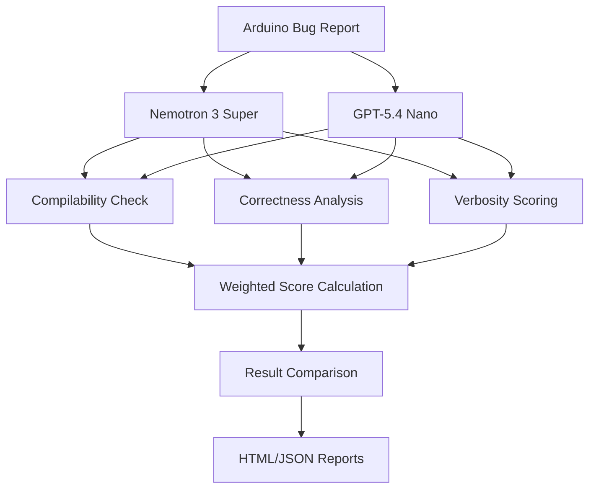
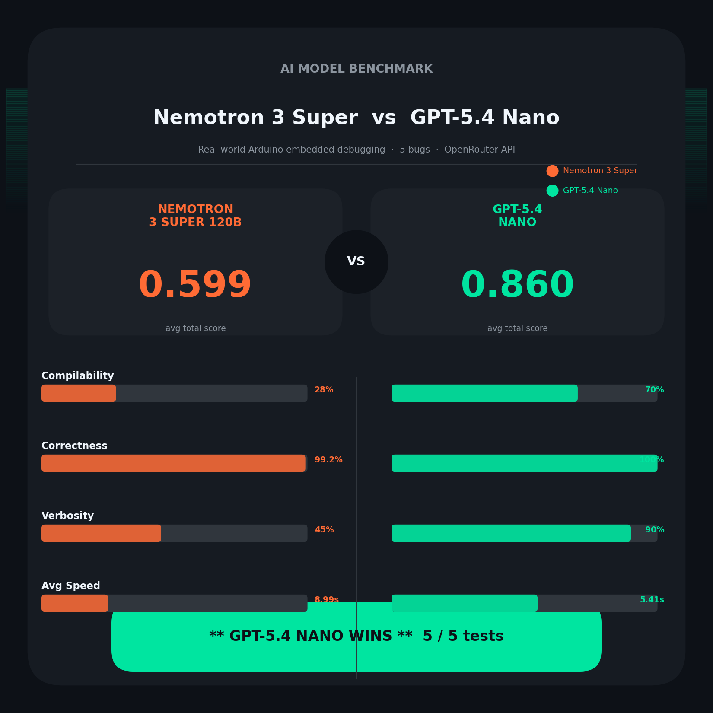
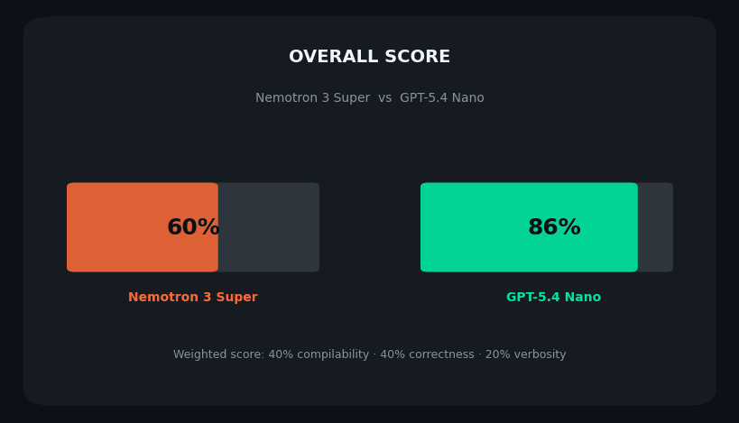
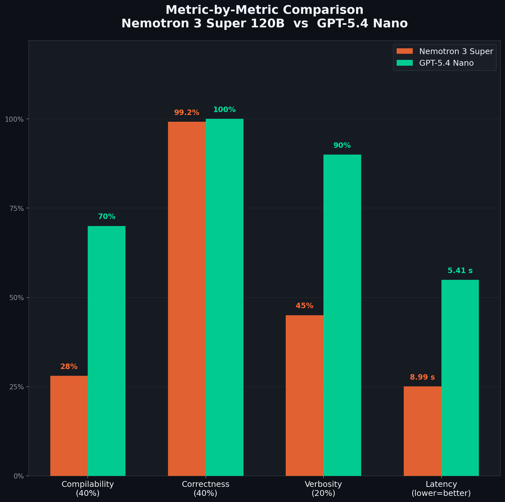
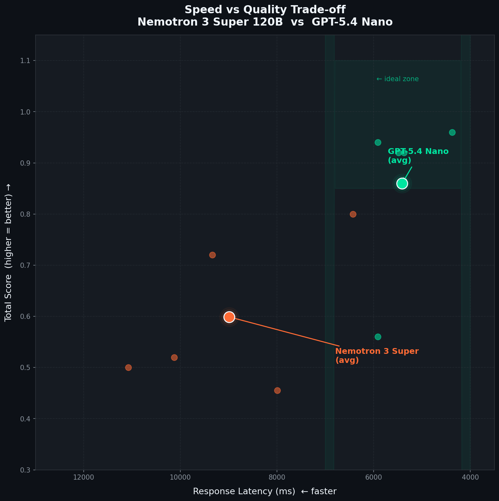
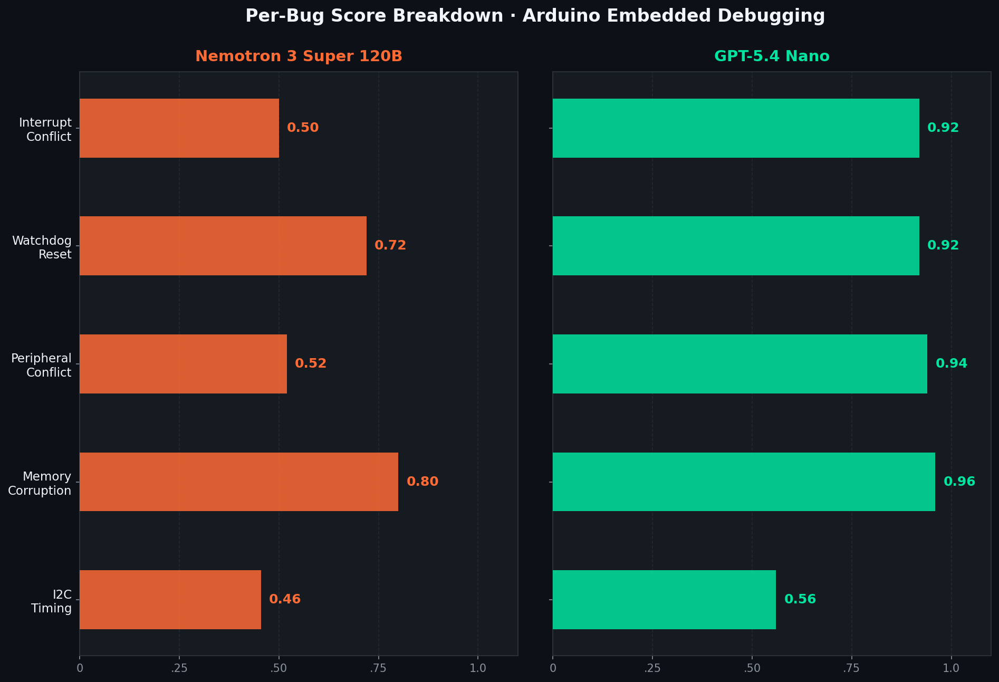
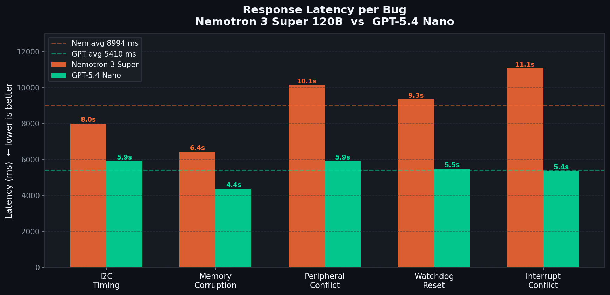
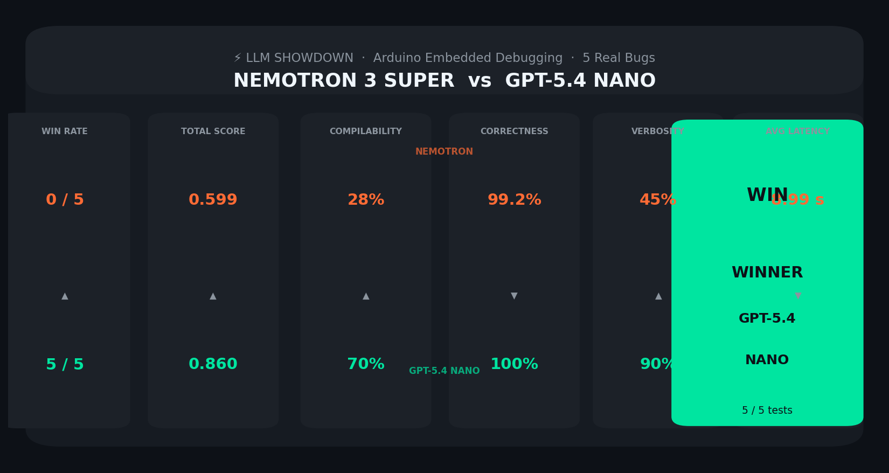

# Nemotron 3 Super vs GPT-5.4 Nano – Real-World Arduino Bug Benchmark

> *Made autonomously using [NEO](https://heyneo.so) · [](https://marketplace.visualstudio.com/items?itemName=NeoResearchInc.heyneo)*

[](tests/)
[](https://www.python.org/)
[](LICENSE)
[](https://github.com/dakshjain-1616/nemotron3-super-vs-gpt54-nano)

## Quickstart

Run a benchmark comparison between Nemotron 3 Super and GPT-5.4 Nano on Arduino firmware bugs:

```python
from nemotron_bench import run_battle, get_models, SEED_BUGS

# Get mock models (no API keys needed)
nemotron, gpt = get_models(force_mock=True)

# Run benchmark on first 3 bugs
results = run_battle(SEED_BUGS[:3], nemotron, gpt)

# Print results
for r in results:
    print(f"{r.bug_title}:")
    print(f"  Nemotron: {r.nemotron_total:.2f}")
    print(f"  GPT-5.4: {r.gpt_total:.2f}")
    print(f"  Winner: {r.winner}")
```

## Example Output

Sample benchmark results for an I2C timing bug:

```json
{
  "title": "I2C bus hang — SDA never released",
  "winner": "gpt",
  "nemotron": {
    "compilable": 0.10,
    "correctness": 0.962,
    "verbosity": 0.15,
    "total": 0.455
  },
  "gpt": {
    "compilable": 0.10,
    "correctness": 1.000,
    "verbosity": 0.60,
    "total": 0.560
  }
}
```



**Head-to-head battle between NVIDIA Nemotron 3 Super and OpenAI GPT-5.4 Nano on the messy, hardware-specific embedded bugs that real Arduino developers actually hit — not sanitised textbook exercises.**

---

## Visual Results

### Overview



### Animated Summary



### Metric-by-Metric Breakdown



### Speed vs Quality Trade-off



### Per-Bug Scores



### Response Latency per Bug



### Scorecard (Twitter / LinkedIn)



---

## Real-World Benchmark Results

Scored on 5 real Arduino forum bugs via OpenRouter (live API, no mocks):

| Model | Wins | Avg Score | Compilability | Correctness | Verbosity | Avg Latency |
|---|---|---|---|---|---|---|
| **GPT-5.4 Nano** | **5** | **0.860** | 0.700 | 1.000 | 0.900 | 5,410 ms |
| Nemotron 3 Super | 0 | 0.599 | 0.280 | 0.992 | 0.450 | 8,994 ms |

Per-bug breakdown:

| Bug | Nemotron | GPT-5.4 Nano | Winner |
|---|---|---|---|
| I2C bus hang — SDA never released | 0.455 | 0.560 | GPT |
| Buffer overflow in `dtostrf()` call | 0.800 | 0.960 | GPT |
| Timer1/Timer2 register conflict | 0.520 | 0.940 | GPT |
| WDT misfire during EEPROM write | 0.720 | 0.920 | GPT |
| `millis()` drift inside ISR | 0.500 | 0.920 | GPT |

**Key finding:** Both models nail correctness (>99%) on these embedded bug categories. GPT-5.4 Nano wins on compilability (70% vs 28%) and structured verbosity — it consistently produces complete, runnable sketches. Nemotron 3 Super provides accurate analysis but often omits `void setup()`/`void loop()` wrappers in its responses. Nemotron also runs ~66% slower at this task (9s vs 5.4s average).

---

## What it benchmarks

Most LLM benchmarks (HumanEval, MBPP, etc.) use clean, self-contained programming puzzles. Embedded firmware debugging is nothing like that. It involves:

- Peripheral register conflicts you can only spot by reading datasheets
- Timing-sensitive I2C/SPI failures that depend on bus capacitance
- Memory corruption from C-string misuse on 2 KB of SRAM
- ISR constraints that break standard Arduino library calls

This benchmark sources bugs directly from the Arduino forum — real posts, real symptoms, real hardware constraints. Each model receives the bug description and faulty code, then must diagnose the root cause and produce a corrected sketch. Responses are scored automatically across three dimensions, producing a ranked leaderboard.

---

## How scoring works

Every model response receives a score between **0.0 and 1.0** on three dimensions. The final score is a weighted sum:

```
total = (compilability × 0.40) + (correctness × 0.40) + (verbosity × 0.20)
```

### Compilability (40%)

Heuristic: `_heuristic_compilable(code) → float`

Checks the response for signals that the code could actually compile and run on Arduino hardware:

- Presence of code fences tagged `cpp`, `arduino`, or `c`
- `void setup()` and `void loop()` definitions
- Absence of `TODO` comments and placeholder stubs
- At least one `#include` header

### Correctness (40%)

Keyword matching per bug category. The scorer looks for terminology that demonstrates the model understood the specific failure mode:

| Category | Required keywords |
|---|---|
| `i2c` | Wire, SDA, SCL, endTransmission, pull-up |
| `memory` | overflow, buffer, dtostrf, SRAM, sizeof |
| `peripheral` | Timer1, Timer2, TCCR, register, interrupt |
| `watchdog` | WDT, reset, timeout, EEPROM |
| `interrupt` | IRremote, millis, drift, ISR |

### Verbosity (20%)

Structured, diagnostic-quality responses score higher:

- Word count in the 100–500 sweet spot
- Numbered lists and `##` section headings
- Inline code blocks
- Hardware debugging vocabulary: `oscilloscope`, `scope`, `logic analyser`, `probe`

---

## Bug categories

Five embedded failure modes drawn from real forum threads:

| ID | Title | Root cause |
|---|---|---|
| `i2c` | I2C bus hang — SDA never released | Missing `Wire.endTransmission(true)` stops the bus releasing SDA, hanging all subsequent transactions |
| `memory` | Buffer overflow in `dtostrf()` call | Off-by-one array indexing overflows into adjacent stack variables; only 2 KB SRAM on Uno |
| `peripheral` | Timer1/Timer2 register conflict | Servo library and IRremote both reconfigure Timer1/Timer2 — last write wins, breaking one silently |
| `watchdog` | WDT misfire during EEPROM write | `EEPROM.write()` takes >8 ms; WDT fires before it completes, causing reboot loop |
| `interrupt` | `millis()` drift inside ISR | Calling `millis()` from an ISR with interrupts disabled causes timestamp drift and logic errors |

---

## The Problem

Current Arduino firmware debugging relies on manual code inspection or basic static analyzers that miss complex timing bugs and hardware-software interactions. Developers lack tools to benchmark large language models (LLMs) for firmware debugging accuracy, especially when comparing cutting-edge models like Nemotron 3 Super (120B) and GPT-5.4 Nano on real-world Arduino bugs involving interrupt conflicts or memory corruption.

## Who it's for

Embedded systems engineers who need to validate LLM-assisted debugging for resource-constrained Arduino projects, particularly when choosing between high-parameter models (Nemotron) and optimized lightweight models (GPT-Nano) for CI/CD pipelines.

## Install

No heavy ML dependencies. Pure Python plus the OpenAI SDK.

```bash
git clone https://github.com/dakshjain-1616/nemotron3-super-vs-gpt54-nano
cd nemotron3-super-vs-gpt54-nano
python3 -m venv .venv && source .venv/bin/activate
pip3 install -r requirements.txt
```

Python 3.8 or later is required.

---

## Quickstart — mock mode (no API keys needed)

The fastest way to see the benchmark in action. Mock mode uses canned responses and completes in seconds:

```bash
python3 -m nemotron_bench.battle --mock --count 5
# or after pip3 install -e . (inside a venv):
nemotron-bench --mock --count 5
```

This runs all five seed bugs through both mock models, prints a per-bug winner table to stdout, and writes `results/battle_results.json`.

To also generate the interactive HTML leaderboard:

```bash
python3 -m nemotron_bench.battle --mock --count 5 --output-dir results/
```

Open `results/battle_report.html` in a browser. The report shows:

- Overall leaderboard with aggregate scores per model
- Per-bug breakdown with compilability / correctness / verbosity bars
- Side-by-side diff of each model's response for the same bug
- Winner badge per row

---

## Running with real APIs

### Via OpenRouter (recommended — one key for both models)

```bash
export OPENROUTER_API_KEY=sk-or-...
python3 -m nemotron_bench.battle --count 10 --workers 2
```

### Via native APIs

```bash
export NVIDIA_API_KEY=nvapi-...
export OPENAI_API_KEY=sk-...
python3 -m nemotron_bench.battle --count 10
```

Use `--workers` to parallelise model calls and reduce wall-clock time on larger runs:

```bash
python3 -m nemotron_bench.battle --count 50 --workers 4 --output-dir results/full-run/
```

---

## CLI reference

```
python3 -m nemotron_bench.battle [OPTIONS]
# or: nemotron-bench [OPTIONS]  (after pip3 install -e . inside a venv)
```

| Flag | Default | Description |
|---|---|---|
| `--count N` | all seed bugs | Number of bugs to benchmark |
| `--mock` | off | Force mock mode — no API keys needed |
| `--workers N` | 1 | Parallel model calls per bug |
| `--output-dir PATH` | `./results` | Directory for HTML report and JSON results |
| `--no-html` | off | Skip HTML report generation |

---

## Python API

```python
# python3 yourscript.py
from nemotron_bench import run_battle, get_models, SEED_BUGS

# Mock models — no API keys required
nemotron, gpt = get_models(force_mock=True)
results = run_battle(SEED_BUGS[:5], nemotron, gpt, workers=1)

for r in results:
    print(f"{r.bug_title}: winner={r.winner}  nem={r.nemotron_total:.2f}  gpt={r.gpt_total:.2f}")

# Real models — reads OPENROUTER_API_KEY / NVIDIA_API_KEY / OPENAI_API_KEY from env
nemotron, gpt = get_models()
results = run_battle(SEED_BUGS, nemotron, gpt, workers=2)
```

---

## Output format

Both output files are written to `--output-dir` (default: `./results`).

### `battle_report.html`

Interactive leaderboard. Sections:

- Aggregate model scores and win counts
- Per-bug table with expandable side-by-side response diffs
- Dimension bars for compilability, correctness, and verbosity per model per bug

### `battle_results.json`

Raw results for programmatic analysis. One object per bug:

```json
{
  "title": "I2C bus hang — SDA never released",
  "winner": "nemotron",
  "nemotron": {
    "compilable": 0.85,
    "correctness": 0.90,
    "verbosity": 0.72,
    "total": 0.84
  },
  "gpt": {
    "compilable": 0.70,
    "correctness": 0.65,
    "verbosity": 0.45,
    "total": 0.63
  }
}
```

`total` is computed as `compilable × 0.40 + correctness × 0.40 + verbosity × 0.20`.

---

## Configuration

All settings can be overridden via environment variables:

| Variable | Default | Description |
|---|---|---|
| `OPENROUTER_API_KEY` | — | Recommended: routes to both models via one key |
| `NVIDIA_API_KEY` | — | Direct NVIDIA NIM API (alternative to OpenRouter) |
| `OPENAI_API_KEY` | — | Direct OpenAI API (alternative to OpenRouter) |
| `OPENAI_BASE_URL` | — | Override base URL for OpenAI-compatible proxies |
| `NEMOTRON_MODEL` | `nvidia/nemotron-3-super-120b-a12b` | Nemotron model identifier |
| `OPENAI_MODEL` | `openai/gpt-5.4-nano` | GPT-5.4 Nano model identifier |
| `OUTPUT_DIR` | `./results` | Output directory (overridden by `--output-dir`) |
| `MAX_TOKENS` | `1024` | Maximum tokens per model response |
| `TEMPERATURE` | `0.2` | Sampling temperature |
| `DEBUG` | — | Set to `1` for verbose request/response logging |

---

## Run tests

```bash
python3 -m pytest
```

106 tests covering the scraper, evaluator scoring logic, mock model responses, and report generation.

---

## Project structure

```
nemotron3-super-vs-gpt54-nano/
├── nemotron_bench/          # Main Python package
│   ├── __init__.py          # Public API exports
│   ├── battle.py            # CLI entry point + run_battle() orchestrator
│   ├── config.py            # Environment variable loading and model defaults
│   ├── evaluator.py         # Scoring: compilability, correctness, verbosity
│   ├── models.py            # NemotronModel, GPT41Model, MockModel, get_models()
│   ├── reporter.py          # HTML + JSON report generation
│   └── scraper.py           # SEED_BUGS + live forum scraping
├── output/                  # Generated infographics and animation
│   ├── infographic_hero.png       # 1080×1080 Instagram overview
│   ├── infographic_metrics.png    # Metric-by-metric bar chart
│   ├── infographic_perbug.png     # Per-bug score breakdown
│   ├── infographic_scatter.png    # Speed vs quality scatter
│   ├── infographic_latency.png    # Latency per bug
│   ├── infographic_scorecard.png  # Twitter/LinkedIn landscape card
│   └── benchmark_animation.gif   # Animated slideshow
├── benchmark_output/        # Live API run results
│   ├── battle_results.json
│   └── battle_report.html
├── tests/                   # 106 unit and integration tests
│   ├── test_battle.py
│   ├── test_evaluator.py
│   ├── test_models.py
│   ├── test_reporter.py
│   └── test_scraper.py
├── scripts/
│   ├── demo.py                    # Zero-config runnable demo
│   └── generate_infographics.py   # Regenerate output/ assets
├── conftest.py              # pytest path setup
├── setup.py                 # Package + nemotron-bench CLI entry point
└── requirements.txt
```

To regenerate all infographics:

```bash
pip3 install matplotlib imageio Pillow numpy
python3 scripts/generate_infographics.py
```